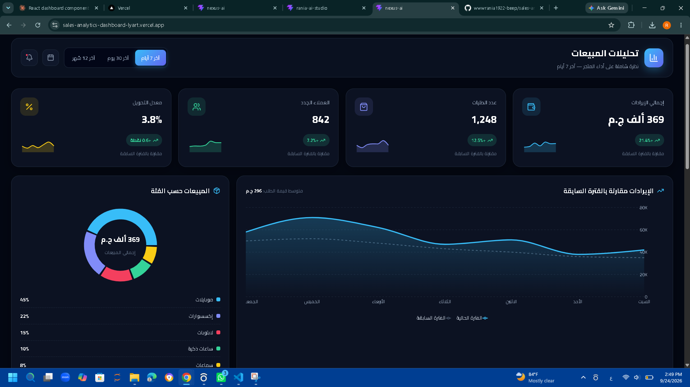

# 📊 Sales Analytics Dashboard

لوحة تحكم تفاعلية لتحليل مبيعات متجر إلكتروني مصري، مبنية بـ React و Recharts.

🔗 **Live Demo:** [YOUR-LINK](YOUR-LINK)



## ✨ المميزات

- **فلترة حسب الفترة**: 7 أيام، 30 يوم، أو 12 شهر، وكل الأرقام والرسومات بتتحدث تلقائيًا
- **مقارنة بالفترة السابقة**: لقياس نمو الإيرادات
- **مؤشرات أداء رئيسية (KPIs)**: الإيرادات، الطلبات، العملاء الجدد، معدل التحويل
- **توزيع المبيعات** حسب الفئة والمحافظة
- **ترتيب المنتجات الأكثر مبيعًا**
- **جدول طلبات تفاعلي** فيه بحث وفلترة بالحالة
- **تصدير البيانات إلى Excel (CSV)** مع دعم كامل للعربي
- **تصميم متجاوب** يشتغل على الموبايل والتابلت والكمبيوتر
- **دعم كامل للغة العربية (RTL)**

## 🛠️ التقنيات المستخدمة

- React
- Vite
- Recharts
- Lucide React

## 🚀 التشغيل محليًا

```bash
git clone https://github.com/wwwrania1922-beep/sales-analytics-dashboard.git
cd sales-analytics-dashboard
npm install
npm run dev
```

## 👩‍💻 المطورة

**Esraa Meslam** — Data Scientist & AI Engineervite/template-react-ts) for information on how to integrate TypeScript and Oxlint's TypeScript related rules in your project.
